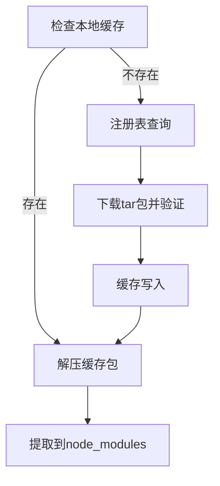

## 考察点分析

本题主要考察以下核心能力维度：

1. **模块化工程理解**：对Node.js生态依赖管理的整体认知
2. **版本解析能力**：语义化版本控制（SemVer）的实际应用
3. **依赖管理机制**：包管理器核心算法与安装策略
4. **工程化思维**：node_modules结构设计与安装优化

具体技术评估点：

- 依赖拓扑排序与冲突解决算法
- 缓存加速机制与网络请求优化
- 扁平化结构带来的幽灵依赖问题
- lock文件锁定版本原理
- 多层级依赖的去重策略

---

## 技术解析

### 关键知识点

1. 依赖解析算法 > 缓存机制 > 目录结构设计
2. 语义化版本规范 > 嵌套结构缺陷 > 扁平化优势
3. 确定性安装保障 > lock文件作用 > 校验机制

### 原理剖析

1. **依赖树构建**：

- 递归解析package.json的dependencies/devDependencies
- 使用广度优先遍历构建依赖树，采用拓扑排序解决循环依赖
- 版本选择遵循SemVer规则，优先采用最高兼容版本

2. **下载流程**：



3. **扁平化结构**：
通过提升次级依赖到顶层目录，避免重复安装。冲突时采用嵌套方案：

```bash
node_modules
├─ A@1.0.0
├─ B@1.0.0
│  └─ node_modules
│     └─ C@2.0.0  # 版本冲突时嵌套
└─ C@1.0.0  # 顶层依赖
```

### 常见误区

- 误认为所有依赖都会被扁平化处理（实际存在版本冲突时仍会嵌套）
- 忽略peerDependencies的特殊处理逻辑
- 混淆package.json与package-lock.json的作用边界
- 认为删除node_modules后lock文件能完全恢复环境

---

## 问题解答

执行`npm install`时的工作流程：

1. **依赖解析阶段**

- 读取package.json构建初始依赖列表
- 递归查询注册表解析子依赖，生成依赖树
- 应用SemVer规则确定具体版本，处理版本冲突

2. **包下载阶段**

- 检查本地缓存（~/.npm目录），存在则直接解压
- 缓存未命中时从registry下载tar包并校验完整性
- 写入缓存同时解压到项目node_modules

3. **目录构建阶段**

- 采用扁平化结构安装，将共享依赖提升至顶层
- 版本冲突的依赖安装到各自父模块的node_modules
- 生成/更新package-lock.json记录精确版本

4. **特殊处理**

- 自动安装peerDependencies的兼容版本
- 校验lock文件与package.json的版本声明一致性
- 处理optionalDependencies的安装失败场景

---

## 解决方案

### 缓存优化方案

```bash
# 强制使用缓存安装（离线模式）
npm install --prefer-offline

# 清除缓存后重新安装
npm cache clean --force && npm install
```

### 结构优化建议

1. **依赖层级**：对大型项目采用monorepo结构，通过workspaces拆分模块
2. **安装加速**：使用npx的--timing参数分析安装耗时
3. **版本控制**：将package-lock.json纳入版本库确保环境一致

### 边界处理

```javascript
// 检查依赖是否安装成功
try {
    require.resolve('your-package');
} catch (e) {
    console.error('依赖安装不完整');
    process.exit(1);
}
```

---

## 深度追问

1. **如何保证CI环境安装一致性？**
   - 使用`npm ci`命令，严格依赖lock文件安装

2. **幽灵依赖问题如何解决？**
   - 通过ESLint的import/no-extraneous-dependencies规则检测

3. **如何查看安装耗时瓶颈？**
   - 使用`npm install --timing`生成性能分析文件
