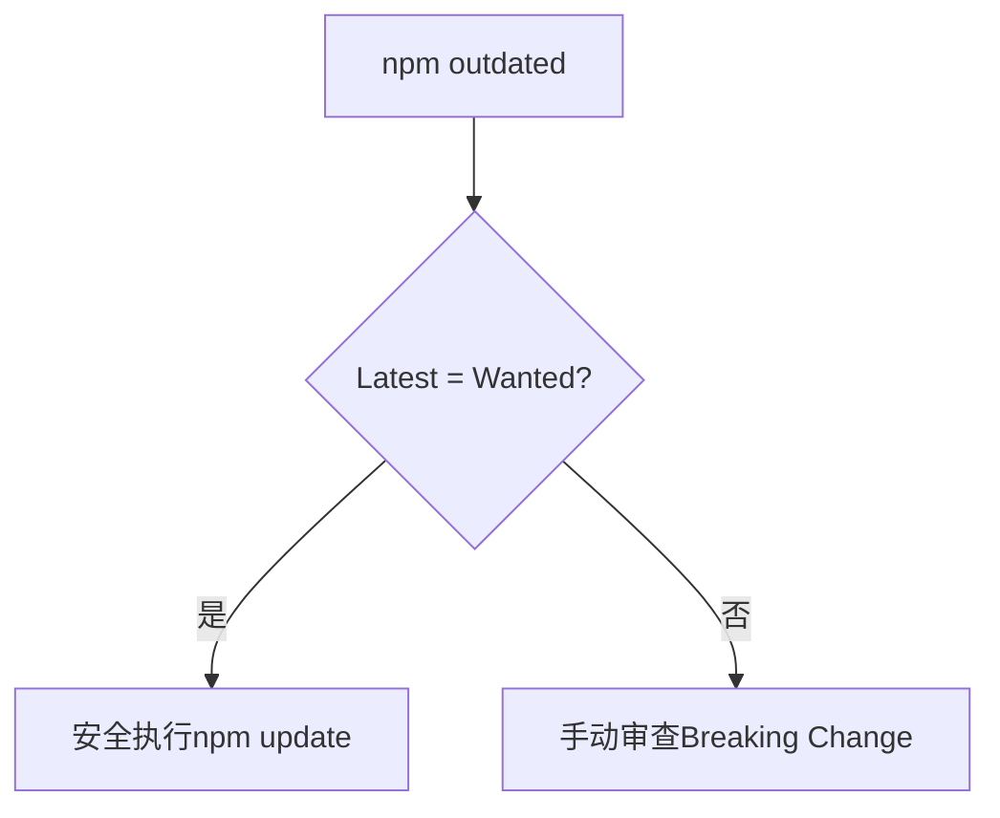

## 回答

---

### 考察点分析

本题主要考察以下核心能力：

1. **依赖管理能力**：通过`npm outdated`识别过时依赖，使用`npm update`控制升级范围
2. **SemVer规范理解**：准确解析版本号语义（major/minor/patch），理解版本符号（^/~）的行为差异
3. **风险控制意识**：避免自动升级导致Breaking Change的防护策略
4. **工程化思维**：制定可持续维护的版本控制方案，平衡稳定性和新特性

具体技术评估点：

- Semantic Versioning规范的实际应用
- npm依赖版本符号的精确含义
- 锁定文件（package-lock.json）的作用机制
- 破坏性变更的识别与处理方法
- 渐进式升级的CI/CD集成方案

---

### 技术解析

#### 关键知识点优先级

1. Semantic Versioning > 2. npm版本符号 > 3. 锁定文件机制 > 4. 依赖范围控制

#### 原理剖析

**SemVer规范**：

- 版本号格式为`MAJOR.MINOR.PATCH`
- MAJOR：不兼容的API修改
- MINOR：向下兼容的功能新增
- PATCH：向下兼容的问题修复

**npm版本符号**：

- `^1.2.3`：允许MINOR和PATCH升级（自动更新到1.x.x）
- `~1.2.3`：仅允许PATCH升级（自动更新到1.2.x）
- 无符号：固定精确版本

**npm outdated输出解析**：

```bash
Package  Current  Wanted  Latest
lodash    4.17.1  4.17.20  5.0.0
```

- Current：当前安装版本
- Wanted：符合package.json约束的最高版本
- Latest：注册表最新版本

**更新策略**：



#### 常见误区

1. 误认`npm update`会升级到Latest版本（实际遵守package.json的版本范围）
2. 混淆`^`与`~`的行为差异导致意外升级
3. 未提交锁定文件引发环境差异
4. 未识别传递依赖（Transitive Dependencies）的版本冲突

---

### 问题解答

建议采用渐进式升级四步法：

1. **版本分析**：

```bash
npm outdated --long # 显示详细版本信息
```

2. **安全升级**：

```bash
npm update # 升级到Wanted版本（不跨MAJOR版本）
```

3. **破坏性升级**：

```bash
npm install lodash@5.0.0 # 指定MAJOR版本
# 运行测试套件和类型检查
```

4. **版本锁定**：

```json
{
  "dependencies": {
    "lodash": "~4.17.20" // 锁定MINOR版本
  }
}
```

---

### 解决方案

#### 编码示例

```javascript
// package.json
{
  "scripts": {
    "safe-update": "npm outdated && npm update && npm test",
    "major-update": "npm install lodash@5.0.0 --save-exact"
  },
  "dependencies": {
    "lodash": "^4.17.20" // 允许自动升级MINOR/PATCH
  }
}
```

**优化说明**：

- `--save-exact`确保精确版本记录
- 预提交hook验证`package-lock.json`
- 复杂度：O(n) 依赖数量线性增长

#### 可扩展性建议

1. **大流量场景**：在Canary Release环境验证升级
2. **低端设备**：锁定依赖版本防止polyfill异常
3. **团队协作**：统一`.npmrc`配置`save-exact=true`

---

### 深度追问

1. **如何解决传递依赖的版本冲突？**
   - 答：使用`npm ls <package>`分析依赖树，通过`resolutions`字段强制版本

2. **怎样验证升级后的类型安全？**
   - 答：集成TS类型检查到CI流程，使用`npm run build --strict`

3. **自动化升级方案推荐？**
   - 答：使用Dependabot配置`target-branch: dependency-upgrades`
