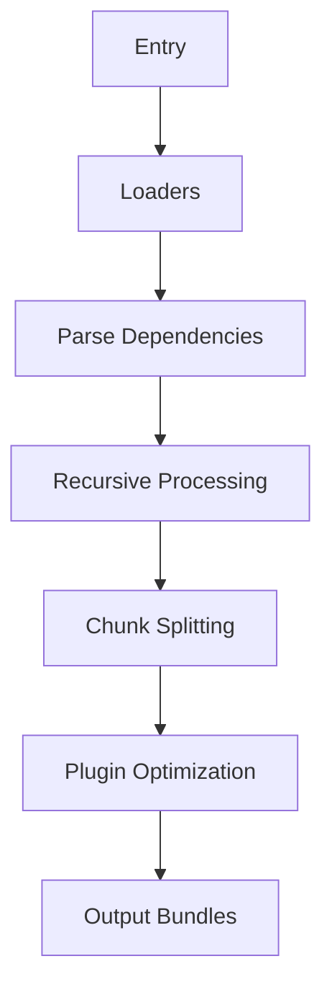

## 考察点分析

本题主要考核以下核心能力维度：

1. **前端工程化理解**：是否掌握现代前端工具链的核心定位
2. **构建工具原理认知**：能否准确描述Webpack的核心机制和工作原理
3. **实战场景映射**：是否具备将工具特性映射到实际开发需求的能力

具体技术评估点：

- 模块化打包的核心价值
- Loader/Plugin机制差异
- 代码分割实现原理
- 开发/生产环境优化策略
- 现代框架工程化集成

## 技术解析

### 关键知识点

模块化打包 > 依赖图构建 > Loader机制 > Plugin系统 > 代码分割

### 原理剖析

Webpack通过入口文件构建依赖图（Dependency Graph），递归分析模块间的import/require关系。关键流程：

1. **初始化**：读取配置，创建Compiler实例
2. **编译**：通过Loader转换非JS资源（如SASS→CSS→JS模块）
3. **封装**：将模块组合成Chunk，应用Plugin优化
4. **输出**：根据配置生成Bundle到指定目录



### 常见误区

1. 混淆Webpack与Gulp的任务定位（资源处理 vs 任务编排）
2. 误认为只能处理JavaScript（实际通过Loader支持任意文件类型）
3. 忽略Tree Shaking的生效条件（ES6模块语法、副作用声明）

## 问题解答

Webpack是现代化前端静态模块打包工具，通过构建模块依赖图实现资源整合。核心功能包括：

1. **模块打包**：将分散模块组合为浏览器可识别的静态资源
2. **Loader管道**：通过链式转换处理非JS资源（如转译TypeScript）
3. **插件系统**：通过生命周期钩子扩展构建能力（如HTML生成）
4. **生产优化**：支持Tree Shaking、代码分割等优化手段

典型应用场景：

- SPA应用打包：将React/Vue组件及其依赖整合为少量bundle
- 性能优化：使用动态导入（dynamic import）实现路由级代码分割
- 多环境适配：通过环境变量区分开发/生产配置

## 解决方案

### 配置示例

```javascript
// webpack.config.js
const path = require('path');
const HtmlWebpackPlugin = require('html-webpack-plugin');

module.exports = {
  mode: 'production', // 模式区分
  entry: './src/index.js', // 入口起点
  output: {
    filename: '[name].[contenthash].js', // 哈希缓存优化
    path: path.resolve(__dirname, 'dist'),
  },
  module: {
    rules: [
      {
        test: /\.js$/,
        exclude: /node_modules/,
        use: 'babel-loader' // ES6+转译
      },
      {
        test: /\.scss$/,
        use: ['style-loader', 'css-loader', 'sass-loader'] // 样式处理链
      }
    ]
  },
  plugins: [
    new HtmlWebpackPlugin({ template: './src/index.html' }) // 自动注入资源
  ],
  optimization: {
    splitChunks: {
      chunks: 'all' // 代码分割优化
    }
  }
};
```

### 扩展性建议

1. **性能优化**：使用cache-loader缓存Loader结果，parallel-webpack并行构建
2. **环境适配**：通过webpack-merge拆分开发/生产配置
3. **体积控制**：配置browserslist实现按需polyfill

## 深度追问

1. **Webpack构建流程可分为哪些阶段？**
构建流程分为初始化、编译、优化、输出四个阶段，Compiler对象贯穿始终

2. **Loader和Plugin的本质区别是什么？**
Loader是文件转换器（单文件处理），Plugin是构建流程扩展点（通过Tapable事件流）

3. **如何理解Webpack的"模块热替换"原理？**
通过WebSocket建立开发服务器与浏览器的通信，动态替换修改的模块而不刷新页面

4. **对比Vite有何优劣？**
Webpack强在生态成熟，Vite优势在开发环境基于ES Modules的秒级启动，但生产构建仍依赖Rollup
