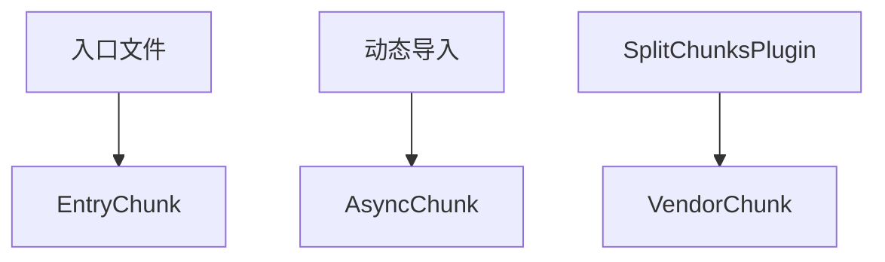

## 回答要求

### 考察点分析
本题主要考察候选人：
1. **Webpack核心机制理解**：对Webpack编译流程的整体认知
2. **构建过程分层能力**：辨别不同抽象层级资源的能力
3. **工程化配置经验**：代码分割、懒加载等进阶配置的实践经验

具体评估点：
- 模块化开发的基本单位（module）
- 代码分割策略的实现载体（chunk）
- 最终产物形态的优化处理（bundle）
- 三者间的转换关系及触发时机

---

### 技术解析

#### 核心概念层级关系
Module（模块）< Chunk（代码块）< Bundle（包文件）

**关键知识点优先级**：
1. 模块解析机制 > 代码分割策略 > 输出配置优化
2. 编译时处理 > 运行时加载

#### 原理剖析
1. **Module**：
```text
项目中的每个独立文件（JS/CSS/图片）都是原始模块
Webpack通过loader将模块转换为有效模块
形成模块依赖图（Module Graph）的关键节点
```

2. **Chunk**：

- 编译阶段根据入口配置和分割规则生成
- 包含运行时代码（Runtime）和模块集合
- 可能对应0-N个最终Bundle

3. **Bundle**：
```javascript
// webpack.config.js
output: {
  filename: '[name].[contenthash].js', // 最终Bundle命名
  path: path.resolve(__dirname, 'dist')
}
```
- 经过压缩/合并/优化后的最终产物
- 可能包含多个Chunk的合并结果
- 携带hash实现长效缓存

#### 常见误区
1. 误认为Chunk与Bundle是1:1对应关系
2. 混淆动态加载与SplitChunks产生的Chunk类型
3. 忽略Runtime代码对Chunk的影响

---

### 问题解答

**Module**是开发层面的独立单元，每个文件对应一个模块，Webpack会构建模块依赖图。**Chunk**是编译过程的中间产物，由入口文件、动态导入或代码分割规则生成，可能包含多个模块。**Bundle**是最终输出的优化文件，一个Chunk可能对应多个Bundle，多个Chunk也可能合并为单个Bundle。

典型场景示例：
- 入口文件`main.js`产生Initial Chunk
- 动态导入`import()`生成Async Chunk
- `SplitChunksPlugin`拆分Vendor Chunk
- 最终输出带hash的Bundle文件如`main.x12df.js`

---

### 解决方案

#### 配置示例
```javascript
// webpack.config.js
module.exports = {
  entry: {
    main: './src/index.js', // 生成main chunk
    admin: './src/admin.js' // 生成admin chunk
  },
  optimization: {
    splitChunks: {
      chunks: 'all' // 生成vendors chunk
    }
  },
  output: {
    filename: '[name].[contenthash].js', // 生成main.x2z.js等Bundle
    chunkFilename: '[id].chunk.js' // 非入口Chunk命名
  }
}
```

#### 优化策略
1. **长效缓存**：使用contenthash防止重复构建
2. **按需加载**：动态导入自动生成Async Chunk
3. **分包优化**：通过splitChunks提取公共依赖

---

### 深度追问

1. **如何验证Chunk划分结果？**
提示：使用webpack-bundle-analyzer分析工具

2. **Runtime代码在Chunk中的分布逻辑？**
提示：通过optimization.runtimeChunk配置分离

3. **Chunkhash与Contenthash的区别？**
提示：Chunkhash基于chunk内容，Contenthash基于文件内容