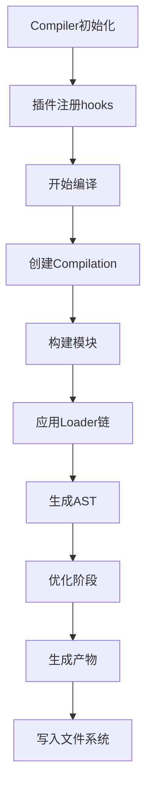

## 二、考察点分析

该题目主要考察候选人的：

1. **工程化能力**：Webpack扩展机制的理解与实战经验
2. **架构设计思维**：Loader/Plugin在构建流程中的角色定位
3. **技术细节把控**：Tapable体系、模块转换机制等核心原理

主要评估点：

- Loader与Plugin的本质区别与适用场景
- Webpack核心Hook系统的使用（compiler/compilation）
- 异步Loader的实现方式（callback/promise）
- 模块AST操作能力（通过loader-utils等工具）
- 构建产物处理技巧（compilation.assets操作）

## 三、技术解析

### 关键知识点优先级

Tapable事件系统 > Loader运行机制 > Plugin架构设计 > AST操作

### 原理剖析

**Loader本质**：导出的函数接收模块源码，通过返回值控制输出。具有链式执行（pitching阶段倒序执行）、文件类型转换、上下文绑定等特性。

**Plugin架构**：基于Tapable的事件驱动架构，通过compiler对象暴露的hook点进行事件订阅。compilation对象包含完整的模块依赖图和构建信息。

**核心流程**：



### 常见误区

1. 混淆Loader的同步/异步处理方式
2. 在Plugin中直接修改源代码（应通过Loader处理）
3. 未正确处理Loader的返回值类型（String/Buffer）
4. 忽略Loader的pitching阶段特性

## 四、问题解答

**Loader开发流程**：

1. 创建导出函数，接收source/content等参数
2. 使用loader-utils获取options配置
3. 通过this.async()处理异步操作
4. 返回处理后的内容（支持字符串/Buffer）

**Plugin开发流程**：

1. 创建包含apply方法的类
2. 获取compiler对象并注册hook
3. 在hook回调中获取compilation进行操作
4. 操作模块依赖图或写入assets

示例代码：

```javascript
// Markdown转Vue组件的Loader
const marked = require('marked');

module.exports = function(source) {
  // 异步处理演示
  const callback = this.async();
  
  marked.parse(source, (err, html) => {
    if(err) return callback(err);
    // 返回Vue组件格式
    callback(null, `<template>${html}</template>`);
  });
};
```

```javascript
// 版本注入插件
class VersionPlugin {
  apply(compiler) {
    compiler.hooks.emit.tap('VersionPlugin', compilation => {
      const manifest = JSON.stringify({ version: Date.now() });
      compilation.assets['version.json'] = {
        source: () => manifest,
        size: () => manifest.length
      };
    });
  }
}
```

## 五、解决方案

### 编码优化建议

1. **Loader缓存**：通过`this.cacheable()`启用缓存加速构建
2. **AST优化**：使用@babel/parser处理复杂转换场景
3. **异常处理**：Loader中需捕获同步/异步错误
4. **性能监控**：在Plugin中集成stats统计

### 扩展性方案

1. **多环境适配**：通过Loader参数实现差异化处理
2. **按需注入**：Plugin动态判断构建模式（dev/prod）
3. **沙箱机制**：使用worker-loader处理CPU密集型Loader

## 六、深度追问

1. **Loader执行顺序如何控制？**
答：从右到左链式执行，可通过pitching阶段拦截

2. **如何调试自定义Loader/Plugin？**
答：使用node --inspect-brk配合Webpack配置

3. **如何处理Loader之间的数据传递？**
答：通过loaderContext._module._buildMeta.xxx传递元信息
