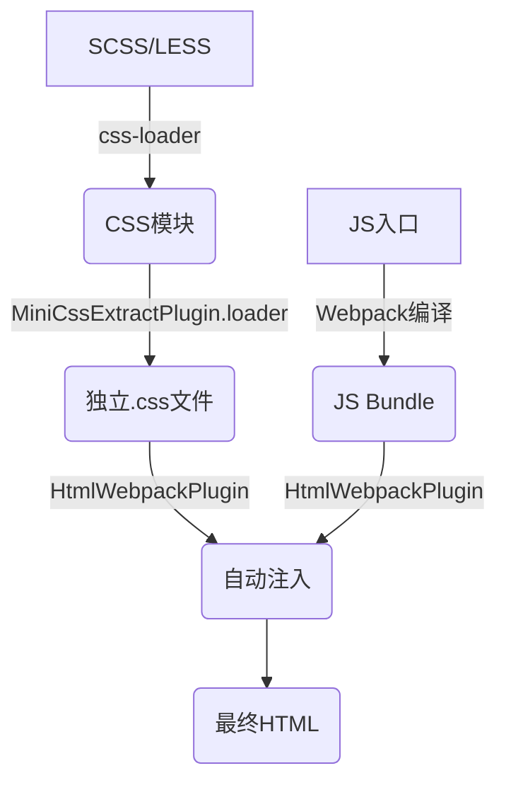

## 考察点分析

该题目主要考察以下核心能力：

1. **Webpack高级配置能力**：对资源分离打包的工程化实践
2. **插件系统理解**：掌握常用插件(MiniCssExtractPlugin/HtmlWebpackPlugin)的协同工作机制
3. **构建流程优化**：处理不同类型资源的编译、提取、注入全流程

具体评估点：

- CSS提取与JS代码分离的实现方式
- HTML模板与资源注入的自动化处理
- 文件哈希与长效缓存配置
- 多类型Loader的协同工作
- 生产环境优化配置意识

---

## 技术解析

### 关键知识点

1. MiniCssExtractPlugin：CSS代码分离
2. HtmlWebpackPlugin：HTML模板生成
3. Webpack模块规则(Module Rules)
4. 文件指纹(Content Hash)
5. 资源注入机制

### 原理剖析

Webpack通过Loader处理CSS文件时，默认会将样式通过JS插入DOM。MiniCssExtractPlugin通过创建独立编译阶段，将CSS提取为独立文件，并重构依赖关系。HtmlWebpackPlugin则通过Tapable钩子系统监听编译过程，在emit阶段将生成的资源注入HTML模板。



### 常见误区

1. 未移除style-loader导致冲突
2. 忽略contenthash导致的缓存失效
3. 多入口场景未配置chunks参数
4. 未处理publicPath导致资源路径错误

---

## 问题解答

通过四步实现资源分离：

1. **安装依赖**：`npm install mini-css-extract-plugin html-webpack-plugin --save-dev`
2. **配置CSS提取**：替换style-loader为MiniCssExtractPlugin.loader
3. **配置HTML生成**：设置模板文件和自动注入
4. **设置文件指纹**：添加contenthash控制缓存

关键配置示例：

```javascript
const MiniCssExtractPlugin = require('mini-css-extract-plugin');
const HtmlWebpackPlugin = require('html-webpack-plugin');

module.exports = {
  entry: './src/index.js',
  output: {
    filename: '[name].[contenthash:8].js',
    clean: true
  },
  module: {
    rules: [
      {
        test: /\.css$/i,
        use: [
          MiniCssExtractPlugin.loader, // 替换style-loader
          'css-loader'
        ]
      }
    ]
  },
  plugins: [
    new HtmlWebpackPlugin({
      template: './src/index.html', // 自定义模板
      inject: 'body' // 资源注入位置
    }),
    new MiniCssExtractPlugin({
      filename: '[name].[contenthash:8].css' // 带哈希的CSS文件名
    })
  ]
};
```

---

## 解决方案

### 编码示例优化

```javascript
// webpack.prod.js
const CssMinimizerPlugin = require('css-minimizer-webpack-plugin');

module.exports = {
  // ...其他配置
  optimization: {
    minimizer: [
      `...`, // 继承默认JS压缩
      new CssMinimizerPlugin() // CSS压缩
    ],
    splitChunks: {
      chunks: 'all' // 公共模块拆分
    }
  }
};
```

### 可扩展性建议

1. **大流量场景**：启用CDN配置publicPath
2. **低端设备**：添加postcss-preset-env处理兼容性
3. **多主题场景**：配置多个MiniCssExtractPlugin实例
4. **微前端场景**：设置excludeChunks避免资源冲突

---

## 深度追问

### 追问1：如何实现按需加载CSS？

**提示**：使用动态import语法 + magic comment定义chunk名称

### 追问2：如何处理字体文件的路径问题？

**提示**：配置file-loader的publicPath与output一致

### 追问3：如何监控CSS文件体积？

**提示**：使用webpack-bundle-analyzer可视化分析
