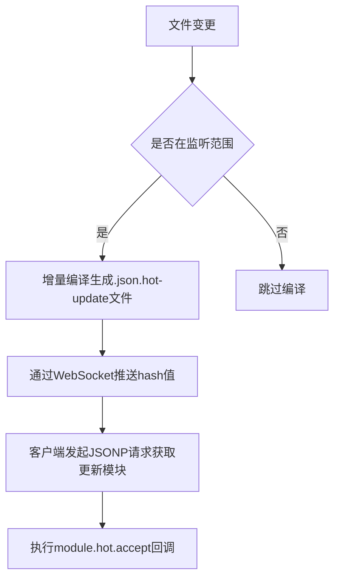

## 回答

### 考察点分析

本题考察候选人以下几方面能力：

1. **HMR核心机制理解**：是否掌握Webpack热更新流程（文件监听→增量编译→模块替换→状态保持）
2. **工程化优化思维**：能否系统性地从构建速度、模块粒度、通信效率等维度提出优化方案
3. **工具链熟悉度**：是否了解主流框架专属HMR方案（如React Fast Refresh）与Webpack生态工具链的配合使用
4. **配置调优能力**：能否正确使用`hotOnly`、`lazy`等配置项控制HMR行为
5. **性能分析手段**：是否掌握测量HMR耗时的方法（如speed-measure-webpack-plugin）

### 技术解析

#### 关键知识点

1. 模块缓存策略 > 通信协议优化 > 增量编译控制
2. HMR工作流程：文件修改→Webpack DevServer推送更新→客户端应用新模块
3. 优化核心：最小化编译范围、复用缓存数据、减少序列化开销

#### 原理剖析



#### 常见误区

- 盲目启用所有文件的HMR（应排除node_modules）
- 未区分开发/生产环境的source map配置（eval-source-map影响编译速度）
- 忽略CSS热更新导致的样式闪动问题

### 问题解答

优化手段及原理如下：

1. **配置调优**

```javascript
// webpack.config.js
module.exports = {
  devServer: {
    hot: true,         // 启用HMR
    hotOnly: true,     // 编译失败时不刷新页面
    lazy: false,       // 关闭延迟编译（需主动访问才编译）
    headers: {         // 提升websocket通信效率
      'Access-Control-Allow-Origin': '*'
    }
  },
  cache: {
    type: 'filesystem' // Webpack5持久化缓存
  }
}
```

2. **编译优化**

- 使用`include`限制loader作用范围

```javascript
module: {
  rules: [{
    test: /\.js$/,
    include: path.resolve(__dirname, 'src'),
    use: ['babel-loader?cacheDirectory=true']
  }]
}
```

3. **框架专属方案**

- React使用`react-refresh-webpack-plugin`代替`react-hot-loader`，
  支持函数组件状态保持
- Vue项目启用`vue-loader`内置的HMR支持

4. **模块过滤**

```javascript
watchOptions: {
  ignored: /node_modules/  // 跳过第三方库监听
}
```

### 解决方案

#### 性能对比示例

```javascript
// 优化前后编译耗时对比
const SpeedMeasurePlugin = require('speed-measure-webpack-plugin')
module.exports = smp.wrap({
  // 优化后的配置
})
```

#### 扩展性建议

- 大型项目采用**动态入口拆分**（DLL已过时）
- 使用`webpack-dev-middleware`实现自定义HMR服务
- 低端设备启用`output.pathinfo: false`减少生成代码量

### 深度追问

1. **如何定位HMR性能瓶颈？**
   - 使用`webpack --profile --json > stats.json`生成构建报告
2. **Webpack5相较Webpack4在HMR方面有何改进？**
   - 内置持久化缓存、改进的Tree Shaking算法
3. **如何处理HMR中的循环依赖问题？**
   - 使用`CircularDependencyPlugin`检测，重构模块结构
