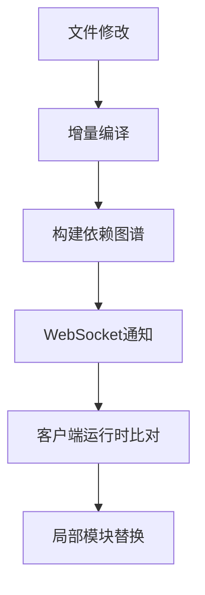
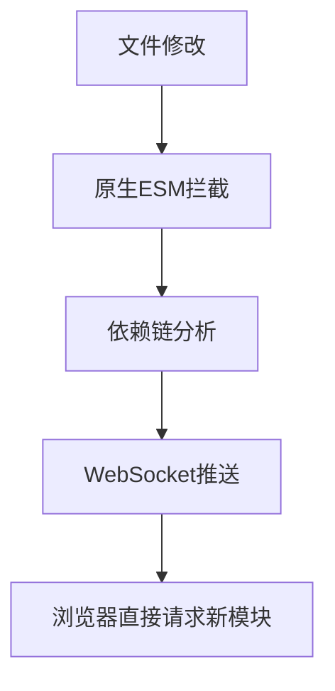

## 回答

### 考察点分析

此问题主要考核以下核心能力维度：

1. **构建工具原理理解**：掌握现代构建工具的核心工作机制差异
2. **ES模块规范应用**：辨析原生ESM与打包方案对开发体验的影响
3. **工程化思维**：理解不同构建策略对热更新效率的优化手段

具体技术评估点：

1. 原生ES模块与打包后模块的热更新路径差异
2. 依赖预构建对HMR性能的影响机制
3. 模块更新粒度的实现原理对比
4. 浏览器模块请求机制与构建工具协同工作原理

---

### 技术解析

#### 关键知识点优先级

1. 原生ES模块支持 > 依赖预构建策略 > 更新传播路径
2. 浏览器模块系统 vs 打包器运行时
3. 模块热替换的边界判定机制

#### 原理剖析

**Webpack HMR机制**：



通过打包器维护的模块依赖图，采用JSON补丁方式进行模块替换，需经过完整的编译链，存在更新延迟。

**Vite HMR机制**：



利用浏览器原生ESM特性，通过`import.meta.hot`API实现精准模块替换，省去打包环节实现毫秒级更新。

#### 典型差异对比

| 维度        | Webpack          | Vite            |
|-------------|------------------|-----------------|
| 模块处理    | 打包为闭包       | 原生ESM         |
| 更新延迟    | 二次编译耗时     | 浏览器直接加载   |
| 更新粒度    | 模块级          | 文件级          |
| 依赖处理    | 全量打包         | 预构建+按需编译 |

**常见误区**：

1. 混淆生产构建与开发模式的热更新机制
2. 认为Vite完全不需要打包（实际存在预构建阶段）
3. 低估依赖预构建对裸模块加载的优化作用

---

### 问题解答

Vite与Webpack的HMR差异主要体现在三个层面：

1. **ES模块支持**：
Vite直接使用浏览器原生ESM，通过`<script type="module">`加载源码，实现模块级热替换。Webpack需将模块打包为运行时闭包，通过`eval`执行代码，存在封装层带来的性能损耗。

2. **依赖预构建**：
Vite启动时使用esbuild将CJS模块转为ESM并合并碎片化依赖，建立模块缓存。Webpack在HMR过程中需重新验证整个依赖树，导致大型项目更新延迟显著。

3. **更新粒度**：
Vite通过浏览器原生模块系统可直接定位变更文件，实现文件级热替换。Webpack需通过模块热替换API（`module.hot`）进行依赖边界判断，可能触发连锁更新。

---

### 解决方案

#### 编码示例

```javascript
// Vite HMR API 使用
if (import.meta.hot) {
  import.meta.hot.accept('./module.js', (newModule) => {
    // 精确处理模块更新逻辑
    console.log('模块已热更新:', newModule);
  });
}
```

**优化说明**：

- 采用条件编译确保生产环境剔除HMR代码
- 通过依赖预构建减少模块请求数量
- 利用HTTP/2多路复用降低更新延迟

#### 扩展性建议

1. 大型项目：启用依赖预构建缓存，配置`optimizeDeps.include`锁定核心库
2. 低端设备：使用`@vitejs/plugin-legacy`降级方案
3. 微前端场景：通过`serve.origin`配置确保HMR消息正确路由

---

### 深度追问

1. **如何实现跨框架组件级HMR？**
   - Vite通过插件体系标准化HMR边界（如Vue的`@vitejs/plugin-vue`）

2. **Webpack如何优化HMR性能？**
   - 配置`devServer.hotOnly`减少全量刷新
   - 使用`cache`配置持久化缓存

3. **ESM兼容性问题如何解决？**
   - 预构建转换CJS模块
   - Polyfill动态注入（如`vite-plugin-top-level-await`）
