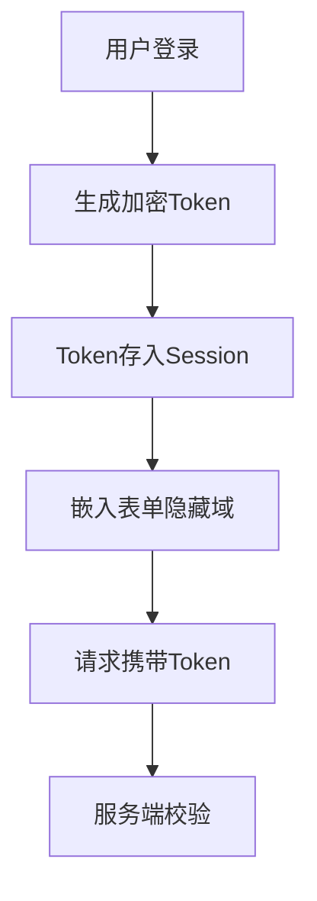

## 考察点分析

该题主要考核候选人对Web安全防御机制的系统性理解，重点评估三个核心维度：

1. **CSRF攻击原理认知**：理解攻击如何利用Cookie自动携带机制
2. **防御方案设计能力**：对比双重Cookie验证与Token校验的实现差异
3. **现代安全机制掌握**：剖析SameSite属性工作原理及浏览器兼容性处理

具体评估点：

- CSRF的会话挟持实现路径
- 双重Cookie验证的XSS防御脆弱性
- Token存储方案的安全性考量
- SameSite属性与CORS策略的协同
- 防御机制组合方案设计

---

## 技术解析

### 关键知识点

SameSite Cookie > CSRF Token > 双重Cookie验证 > 请求来源校验

### 原理剖析

CSRF攻击通过诱导用户访问恶意页面，利用浏览器自动携带身份Cookie的特性伪造请求。防御体系需打破"请求自动携带凭证"和"请求来源不可控"两个关键点。

**双重Cookie验证**：

1. 服务端生成随机Token写入Cookie
2. 前端读取Cookie值作为参数或自定义Header发送
3. 服务端校验请求携带值是否与Cookie匹配

**CSRF Token校验**：



**SameSite Cookie**：

- Strict：完全禁止跨站携带
- Lax：允许导航跳转携带（GET请求）
- None：关闭限制（需配合Secure）

### 常见误区

1. 混淆XSS与CSRF防御方案
2. 误认为SameSite可替代其他CSRF防护
3. 在Token存储时忽略加密签名

---

## 问题解答

CSRF攻击利用浏览器自动携带Cookie的特性，通过伪造用户身份执行敏感操作。双重Cookie验证通过在请求参数或Header中携带Cookie值进行二次校验，但存在XSS漏洞暴露风险。服务端Token校验通过加密令牌实现请求来源认证，配合Session存储更安全。SameSite Cookie通过限制跨站请求的Cookie携带行为，与Token方案形成纵深防御。

防御方案需注意：

1. Token需加密存储并设置有效期
2. 敏感操作使用POST等非幂等方法
3. SameSite设置为Lax平衡安全与可用性

---

## 解决方案

### 双重Cookie实现

```javascript
// 服务端设置Cookie时生成随机Token
res.setHeader('Set-Cookie', [
  `csrf_token=${generateToken()}; HttpOnly; SameSite=Lax`
])

// 前端Ajax请求示例
fetch('/transfer', {
  method: 'POST',
  headers: {
    'X-CSRF-TOKEN': document.cookie.match(/csrf_token=([^;]+)/)[1] 
  }
})
```

### Token校验实现

```javascript
// 生成加密Token（使用HMAC算法）
const crypto = require('crypto')
function generateToken(session) {
  const hmac = crypto.createHmac('sha256', process.env.SECRET)
  return hmac.update(session).digest('hex')
}

// 中间件校验
app.post('/api', (req, res) => {
  const clientToken = req.headers['x-csrf-token']
  const serverToken = generateToken(req.session.id)
  if(!constantTimeCompare(clientToken, serverToken)) {
    return res.sendStatus(403)
  }
})
```

### 优化建议

1. 关键操作增加短信二次验证
2. 重要接口限制同源访问（CORS白名单）
3. 监控异常请求频率

---

## 深度追问

1. **如何防御Token在前端的存储风险？**
   - 使用HttpOnly+Secure Cookie存储，配合加密传输

2. **SameSite兼容性如何处理？**
   - 检测User-Agent降级方案，配合传统Token验证；

3. **CSRF-Token如何防止重放攻击？**
   - 引入时效验证与一次性使用机制；
