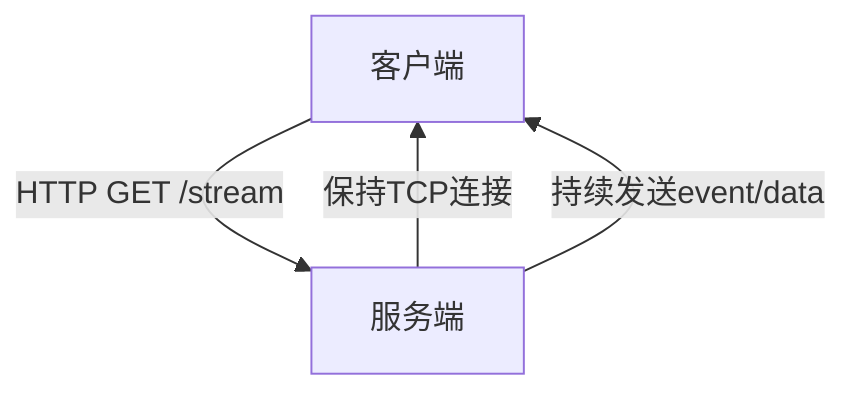

## 考察点分析

该题目主要考察以下核心能力维度：
1. **网络协议理解**：准确区分HTTP长连接与WebSocket协议在OSI模型中的层级差异
2. **实时通信机制**：掌握服务端推送技术与全双工通信的本质区别
3. **技术选型能力**：根据场景特征选择合适通信方案的系统思维

具体技术评估点：
- 协议栈层级差异（HTTP-based vs TCP-based）
- 数据传输方向特性（单工 vs 全双工）
- 连接建立方式与握手过程
- 数据格式与传输效率对比
- 浏览器兼容性与失败恢复机制

## 技术解析

### 关键知识点
1. 协议基础：SSE基于HTTP/1.1长连接，WebSocket采用独立协议
2. 连接方向：SSE单向服务端推送，WebSocket双向实时通道
3. 数据封装：SSE使用文本流，WebSocket支持二进制帧
4. 连接管理：SSE自动重连机制，WebSocket需手动处理
5. 协议开销：SSE头信息冗余，WebSocket握手后净荷高效

### 原理剖析
**SSE（Server-Sent Events）**：
- 基于HTTP长连接，通过`text/event-stream`MIME类型建立持久连接
- 服务端通过`EventSource`API持续发送UTF-8文本数据流
- 内置断线重连机制（`retry`字段控制间隔）
- 通信模型类比"广播电台"：服务端单向发布，客户端被动接收

**WebSocket**：
- 独立协议（ws://, wss://），通过HTTP Upgrade机制建立连接
- 全双工通信，支持二进制帧传输（帧结构包含FIN/RSV/Opcode等控制位）
- 需手动处理连接保持与异常恢复
- 通信模型类似"电话通话"：双方可随时主动交流



### 常见误区
1. 误认为SSE不能跨域（实际支持CORS）
2. 混淆SSE与长轮询机制（SSE是持久连接而非轮询）
3. 低估WebSocket协议复杂度（需处理ping/pong帧维持连接）

## 问题解答

SSE与WebSocket的核心差异体现在协议层与通信模式：
1. **协议基础**：SSE基于HTTP长连接，利用简单文本流传输；WebSocket是独立协议，建立后脱离HTTP上下文
2. **通信方向**：SSE仅支持服务端到客户端的单向推送，WebSocket支持双向实时通信
3. **数据传输**：SSE默认UTF-8文本，WebSocket支持二进制帧且头部开销更小
4. **连接管理**：SSE内置自动重连，WebSocket需手动实现心跳检测
5. **使用场景**：SSE适合股票行情、新闻推送等单向通知场景；WebSocket适用于聊天室、在线协作等双向交互场景

SSE的核心优势在于：
- 天然兼容HTTP生态（身份认证/缓存/代理）
- 零延迟消息推送（长连接保持）
- 自动错误恢复降低开发成本

WebSocket的不可替代性体现在：
- 双向低延迟通信（游戏操作/远程控制）
- 二进制数据传输优化（音视频流）
- 更精细的连接状态控制

## 解决方案

### SSE实现示例
```javascript
// 服务端（Node.js）
app.get('/notifications', (req, res) => {
  res.writeHead(200, {
    'Content-Type': 'text/event-stream',
    'Cache-Control': 'no-cache',
    'Connection': 'keep-alive'
  });

  const timer = setInterval(() => {
    res.write(`data: ${JSON.stringify(update)}\n\n`); // 必须遵循data:格式
  }, 1000);

  req.on('close', () => clearInterval(timer));
});

// 客户端
const es = new EventSource('/notifications');
es.onmessage = ({ data }) => console.log(JSON.parse(data));
```

### WebSocket优化建议
1. 二进制分帧：对大型数据使用ArrayBuffer传输
2. 心跳机制：定期发送ping/pong帧检测连接状态
3. 压缩扩展：启用permessage-deflate压缩降低带宽

## 深度追问

1. **如何为不支持SSE的浏览器提供降级方案？**
   - 使用EventSource polyfill回退到长轮询

2. **WebSocket如何实现请求/响应模式？**
   - 通过消息ID建立映射表实现伪双向通信

3. **SSE如何实现百万连接扩展？**
   - 使用HTTP/2多路复用减少连接数，配合服务端连接池优化