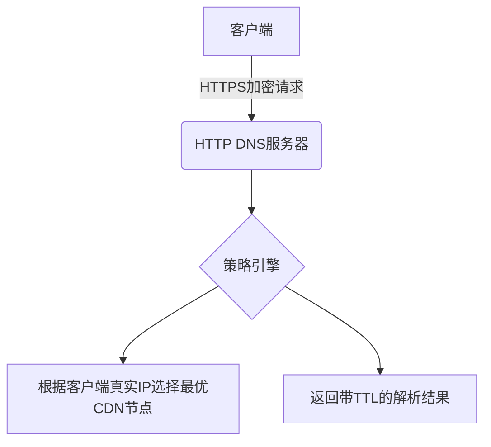

## 回答

### 考察点分析
此题考察候选人三个核心维度：
1. **网络协议理解**：对DNS底层协议及安全风险的分析能力
2. **新型解决方案认知**：HTTP DNS工作原理及与传统架构差异的掌握程度
3. **性能优化思维**：CDN调度策略与网络加速方案的实战经验

具体技术评估点：
- DNS over UDP的中间人攻击漏洞
- HTTP DNS的加密传输机制
- EDNS客户端子网扩展的局限性
- 基于真实客户端IP的CDN调度算法
- 移动端网络切换的容错处理

---

### 技术解析

#### 关键知识点优先级
HTTP DNS协议栈 > UDP协议安全缺陷 > CDN边缘计算 > TLS证书校验 > 客户端网络诊断

#### 原理剖析
**传统DNS劫持风险**：
1. UDP协议无加密特性，响应包可被篡改
2. LocalDNS可能基于策略返回非最优解析结果
3. EDNS客户端子网（ECS）协议支持度不足，导致CDN调度偏差

**HTTP DNS解决方案**：


**精准调度实现**：
1. 客户端携带真实IP直连HTTPDNS API
2. 服务端结合IP地理数据库+实时网络质量数据
3. 返回最低延迟/最近路径的服务器IP
4. 客户端本地缓存+异步更新机制

#### 常见误区
1. 误认为HTTPS完全杜绝DNS劫持（忽略证书伪造风险）
2. 混淆HTTP DNS与DoH(DNS over HTTPS)协议差异
3. 忽略移动网络NAT转换对IP检测的影响

---

### 问题解答
传统DNS使用UDP协议进行域名解析，其无状态、无加密的特性使得中间节点可篡改响应数据，典型劫持场景包括运营商广告注入、钓鱼网站重定向等。HTTP DNS通过基于HTTPS的API查询绕过LocalDNS，直接与权威DNS通信，解决三大问题：

1. **安全增强**：TLS加密传输防止中间人攻击
2. **调度精准**：直接获取客户端出口IP而非LocalDNS IP
3. **实时生效**：绕过DNS缓存实现秒级切换

客户端实现需包含三阶段：
- 启动时预加载常用域名
- 网络切换时主动更新缓存
- 异常时降级传统DNS

---

### 解决方案

```javascript
// HTTP DNS客户端示例
class HttpDNS {
  constructor() {
    this.cache = new Map(); // 使用LRU缓存
  }

  async resolve(domain) {
    // 检查缓存有效性
    if (this.hasValidCache(domain)) {
      return this.cache.get(domain);
    }
    
    try {
      const resp = await fetch(`https://dns-api.com/query?domain=${domain}&clientIP=${this.getRealIP()}`, {
        headers: { 'Accept': 'application/dns-json' }
      });
      const { ip, ttl } = await resp.json();
      
      // 存储时记录时间戳
      this.cache.set(domain, { ip, expires: Date.now() + ttl * 1000 });
      return ip;
    } catch (error) {
      // 降级到系统DNS解析
      return this.fallbackResolve(domain);
    }
  }

  getRealIP() {
    // 通过STUN协议获取真实出口IP
  }
}
```

**优化手段**：
1. 缓存分层：内存缓存 -> 持久化存储
2. 预解析：页面加载前预取关键域名
3. 异步更新：后台定时刷新临近过期记录

**扩展性建议**：
- 低端设备：减少加密计算开销，使用HTTP/2的0-RTT特性
- 大流量场景：客户端实现请求合并，批量查询

---

### 深度追问

1. **如何防止HTTP DNS服务被墙**？
答：采用域名混淆+备用端口+HTTP/3协议

2. **移动端网络切换如何快速感知**？
答：监听NetworkInformation API的change事件

3. **怎样验证解析结果的可靠性**？
答：TCP Ping+首包时间测量+异常上报机制